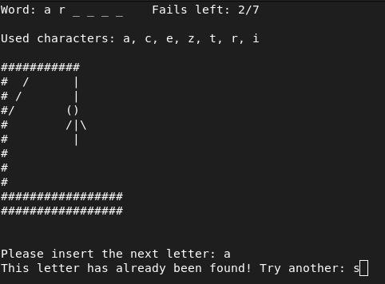

# 42-GNL Hangman



## Description

This is a simple implementation of the classic **Hangman** game in C, including the drawing part as the player guesses letters. The game is designed to be played in the terminal. The most interesting feature is that the game uses the `get_next_line` function, which is an exercise in the **Common Core** at **42 School**.

For educational purposes, the `get_next_line.c` `get_next_line_utils.c` and `get_next_line.h` files are **excluded** from this repository. This allows you to add your own implementation of the function to see how well it works in a real-world application and gives you a sense of accomplishment for making your own version of the function.

## Features

-   Terminal-based Hangman game with ASCII art.
-   Handles multiple wrong guesses with a visual hangman drawing.
-   Modular design that lets you plug in and test your own `get_next_line` function.

## Installation

### Requirements

-   A C compiler (e.g., `cc`).
-   Your own `get_next_line.c`, `get_next_line_utils.c` and `get_next_line.h` files (you need to add them by yourself!).

### Instructions

1.  **Clone the repository**:
```
curl -L -o 42-gnl-hangman.zip https://github.com/N-Determine/42-gnl-hangman/archive/refs/heads/main.zip && unzip 42-gnl-hangman.zip && rm 42-gnl-hangman.zip
```
2.  **Add your get_next_line files**: 

	Place your implementation of `get_next_line.c`, `get_next_line_utils.c` and `get_next_line.h` in the project directory.
    
3.  **Compile the game**:
```
c -Wall -Wextra -Werror -o hangman *.c`
```
   
4.  **Run the game** using one of the modes described below.

## Usage

### Automatic Mode

-   **Default execution**:
    
    `./hangman` 
    
    This mode automatically chooses a random word from the default wordlist `bigger3.txt`. The default wordlist can be changed at the top of `hangman.c`. 

### Manual Mode

1.  **Specify a word manually**:
    
    `./hangman [Word]` 
    
    A specific word can be chosen by a player. The word should only consist of letters from the english alphabet.
    
2.  **Random word from a custom wordlist**:
    
    `./hangman -r [Wordlist]` 
    
    A random word will be chosen from the provided wordlist.
    
3.  **Seed-based random word from a custom wordlist**:
    
    `./hangman [Seed] [Wordlist]` 
    
    A word will be chosen from the given wordlist based on the provided seed. Using the same seed will result in the same word being chosen.
    

## How to Play

-   The game will display a word with underscores representing each letter.
-   You need to guess letters by typing them one at a time.
-   If you guess a letter correctly, it will fill in the blanks.
-   If you guess wrong, the hangman drawing will start to appear piece by piece.
-   Try to guess the word before the hangman is fully drawn! By default, the game allows 7 wrong guesses before it ends. You can change the number of allowed fails in the top of the `hangman.c` file. However, note that the ASCII hangman drawing will **not be shown** if you modify the number of allowed tries from the default value of 7.

## Get Creative!

I encourage everyone to take this hangman game as a starting point and create your own version! Think of how you can modify the rules, change the gameplay, or add new features to make it uniquely yours. This is a fantastic learning experience that will help you deepen your understanding of C programming.

### Challenge Yourself!

Additionally, feel free to brainstorm and develop other games that can utilize the `get_next_line` function. Whether it’s a word-guessing game, a trivia quiz, or something entirely different, the possibilities are endless! 

Creating games can be a fun and rewarding way to enhance your coding skills while enjoying the process. I can’t wait to see what you come up with!


## Credits

-   Game created by **[N-Determine](https://github.com/N-Determine)** as part of learning and contributing to the **42 School** Common Core program.
-  Special thanks to **[DajanPlackovic](https://github.com/DajanPlackovic)** for helping me find possible bugs and leaks in the program.
